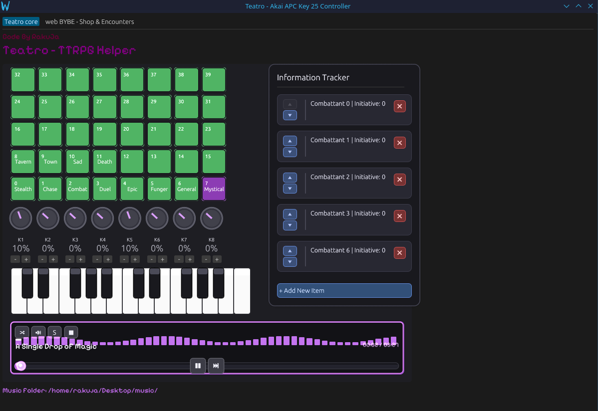

# Teatro - TTRPG Helper

I wrote this application to play music during TTRPG sessions without having to bother meddling with my PC.



# Audio channels
This setup has 3 audio channels that will play independently:
1. Music channel, playing music found in the music folder and played using the buttons. Volume handled by first knob and filters by 2, 3, 4;
2. Ambience channel, playing ambience effect found in the ambience folder using the black keys of the keyboard. Volume handled by 5th knob and filters by all the others;
3. Sound effect channel, playing sound effect found in the sound effect folder using the white keys of the keyboard.

# Midi support
It offers native and built in support for midi channels, tested on Akai APC Key 25 Controller


# Flatpak build

1. Install flatpak-cargo-generator (either from pip/package manager/create venv and install there)
```bash
python -m venv venv 
source venv/bin/activate.fish # could be other extensions depending on system e.g. sh 
pip install flatpak-cargo-generator
```
2. Build generated-sources
```
flatpak-cargo-generator Cargo.lock -o generated-sources.json
```
3. Install flatpak
[Tutorial for all distros](https://docs.flatpak.org/en/latest/first-build.html)
```bash
sudo pacman -S flatpak
```
4. Install flatpak builder
flatpak install org.flatpak.Builder

5. Install deps
```bash
flatpak install flathub org.gnome.Platform//49 org.gnome.Sdk//49
flatpak install flathub org.freedesktop.Sdk.Extension.rust-stable//25.08
```

6. Build
```bash
flatpak-builder --force-clean build-dir io.github.rakuja.teatro.yml # add -v to debug errors
```
or 
Build and install
```bash
flatpak-builder --force-clean --user --install-deps-from=flathub --repo=repo --install builddir io.github.rakuja.teatro.yml
```

7. Bundle
```bash
flatpak-builder --force-clean --repo=repo build-dir io.github.rakuja.teatro.yml
flatpak build-bundle repo your-app.flatpak io.github.rakuja.teatro
```